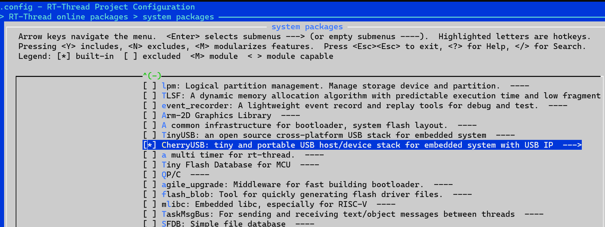
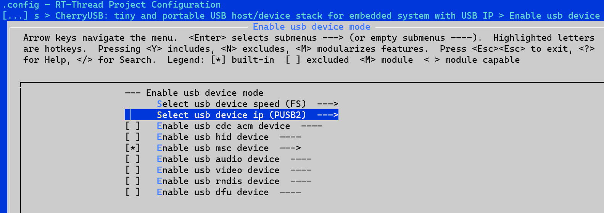
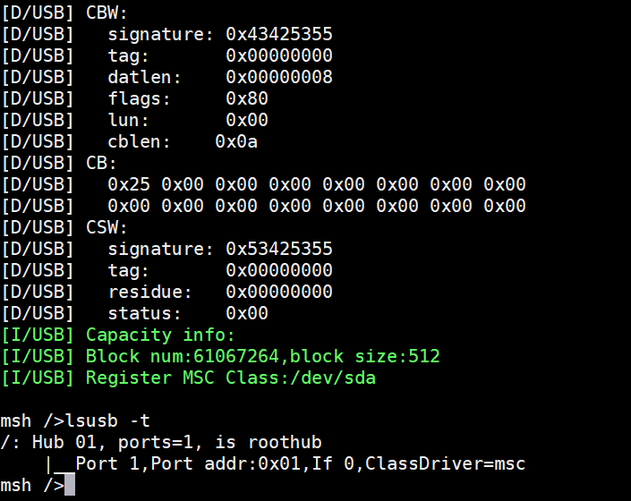

# CherryUSB 的使用

- CherryUSB 是一个小而美的、可移植性高的、用于嵌入式系统(带 USB IP)的 USB 主从协议栈
- Phytium 系列 CPU 相关 BSP 通过 CherryUSB 支持下列功能
- 1. USB 主机（XHCI）, 可以识别 U 盘/鼠标/键盘等设备，但是设备需要插在主机侧的 USB 插槽上，暂不支持通过 HUB 扩展连接设备
- 2. USB 主机 (PUSB2), 可以识别 U 盘/鼠标/键盘等设备
- 3. USB 从机 (PUSB2), 可以将开发板作为一个 USB 设备（U 盘）运行，连接 Windows/Ubuntu 等主机进行识别和访问

> 目前只在 AARCH64 RT-Thread 模式下测试过，AARCH32 使用需要做少量修改，RT-Smart 下使用需要修改链接脚本，增加虚拟内存空间适配

## 通过 Package 使用 CherryUSB

- 进入 bsp 目录下的 aarch64 或者 aarch32 目录，然后 scons --menuconfig 进入 Kconfig 配置界面，选择 `Enable usb host mode` -> `XHCI`，最后选中需要的主机侧设备驱动



- 保存配置后，更新 Packages 

```
source ~/.env/env.sh
pkgs --update
```

- 对于 XHCI, 相关的配置包括


```
#define PKG_USING_CHERRYUSB
#define PKG_CHERRYUSB_HOST
#define PKG_CHERRYUSB_HOST_XHCI
#define PKG_CHERRYUSB_HOST_HID
#define PKG_CHERRYUSB_HOST_MSC
#define PKG_CHERRYUSB_HOST_TEMPLATE
#define PKG_USING_CHERRYUSB_LATEST_VERSION
```

- 对于 PUSB2，相关的配置包括



- 主机模式

```
#define PKG_USING_CHERRYUSB
#define PKG_CHERRYUSB_HOST
#define PKG_CHERRYUSB_HOST_PUSB2
#define PKG_CHERRYUSB_HOST_HID
#define PKG_CHERRYUSB_HOST_MSC
#define PKG_CHERRYUSB_HOST_TEMPLATE
```

- 从机模式

```
#define PKG_USING_CHERRYUSB
#define PKG_CHERRYUSB_DEVICE
#define PKG_CHERRYUSB_DEVICE_FS
#define PKG_CHERRYUSB_DEVICE_PUSB2
#define PKG_CHERRYUSB_DEVICE_MSC
#define PKG_CHERRYUSB_DEVICE_MSC_STORAGE_TEMPLATE
#define PKG_USING_CHERRYUSB_LATEST_VERSION
```

- 更新成功后会出现目录 aarch64/packages/CherryUSB-latest

- 随后进行编译即可

## 测试 CherryUSB 功能

### USB3 (XHCI)

> CherryUSB 更新比较频繁，稳定使用 XHCI 功能可以使用最后一次变更功能的 commit 号

```
cd packages
rm ./CherryUSB-latest/ -rf
git clone https://github.com/cherry-embedded/CherryUSB.git ./CherryUSB-latest
cd ./CherryUSB-latest
git checkout aeffaea016f74cb5d6301b5ca5088c03e3dbe3a6
```

- 将 U 盘插入到 USB3 0 号控制器，然后输入命令 `usbh_initialize` 开始枚举设备
- 枚举完成后输入 `lsusb -t` 查看识别到的设备



- 参考 CherryUSB 中的 demo 使用 USB 设备

### USB2 (PUSB2 主机模式)

> PUSB2 驱动欢迎联系 `opensource_embedded@phytium.com.cn` 获取

- 将 U 盘插入到 USB2 0 号控制器，然后输入命令 `usbh_initialize` 开始枚举设备
- 枚举完成后输入 `lsusb -t` 查看识别到的设备


- 参考 CherryUSB 中的 demo 使用 USB 设备

### USB2 (PUSB2 从机模式)

> PUSB2 驱动欢迎联系 `opensource_embedded@phytium.com.cn` 获取

- 通过 USB 线连接开发板和主机 （Windows 主机），然后输入命令 `msc_storage_init` 创建一个 USB 设备，等待连接的主机完成识别
> 在 RT-Thread 中，可以将 SD/eMMC 介质映射成一个 U 盘给上位机访问，上位机格式化 U 盘文件系统，可以将数据保存在 SD/eMMC 介质中


