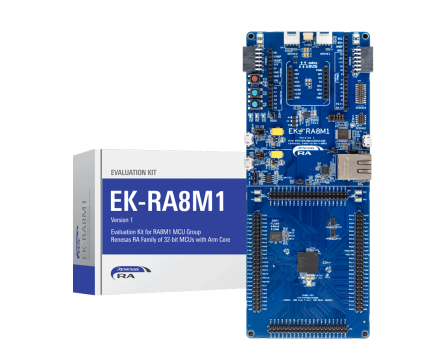

# 瑞萨 EK-RA8M1 开发板 BSP 说明

中文|[English](README_EN.md)

## 简介

本文档为 EK-RA8M1 开发板提供的 BSP (板级支持包) 说明。通过阅读快速上手章节开发者可以快速地上手该 BSP，将 RT-Thread 运行在开发板上。

主要内容如下：

- 开发板介绍
- BSP 快速上手指南

## 开发板介绍

基于瑞萨 RA8M1 MCU 开发的 EK-RA8M1 评估板，通过灵活配置软件包和 IDE，可帮助用户对 RA8 MCU 群组的特性轻松进行评估，并对嵌入系统应用程序进行开发。

开发板正面外观如下图： 



该开发板常用 **板载资源** 如下：

- MCU：R7FA8M1AH，480MHz，**Arm®Cortex®-M85** 内核，2MB 代码闪存, 1MB SRAM
- Jlink OB
- OSPI FLASH（64MX8）
- USB-Host
- USB-Device
- CANFD
- 以太网接口
- 2个PMOD+Arduino+micro BUS接口
- 3个用户LED
- 3个按键：2个用户按键，1个复位按键

**更多详细资料及工具**

## 外设支持

本 BSP 目前对外设的支持情况如下：

| **片上外设** | **支持情况** | **备注** |
| :----------------: | :----------------: | :------------: |
| UART               | 支持               | UART9 为默认日志输出端口 |
| GPIO               | 支持               |                |
| USB | 支持 | TinyUSB |
| Camera | 支持 | ov2640、ov7725、ov7670... |
| SDHC | 支持 | 1bit、4bit |
| ADC | 支持 | |
| DAC | 支持 | |
| SPI | 支持 | |
| PWM | 支持 | |
| RTC | 支持 | |
| FLASH | 支持 | 片上flash |
| WDT | 支持 | |
| IIC | 支持 | |

* 注意：仓库刚拉下来是最小系统，若需添加/使能其他外设需参考：[外设驱动使用教程 (rt-thread.org)](https://www.rt-thread.org/document/site/#/rt-thread-version/rt-thread-standard/tutorial/make-bsp/renesas-ra/RA系列BSP外设驱动使用教程)

## 使用说明

使用说明分为如下两个章节：

- 快速上手

  本章节是为刚接触 RT-Thread 的新手准备的使用说明，遵循简单的步骤即可将 RT-Thread 操作系统运行在该开发板上，看到实验效果 。
  
- 进阶使用

  本章节是为需要在 RT-Thread 操作系统上使用更多开发板资源的开发者准备的。通过使用 ENV 工具对 BSP 进行配置，可以开启更多板载资源，实现更多高级功能。

### 支持的编译平台

* armclang（AC6 V6.19）
* LLVM（V16/17）[ARM-software/LLVM-embedded-toolchain-for-Arm (github.com)](https://github.com/ARM-software/LLVM-embedded-toolchain-for-Arm/releases/tag/release-17.0.1)

## FSP版本说明

本BSP使用的是FSP5.0.0版本，进行外设相关开发需要下载并安装。

* 下载链接：[rasc-5.0.0](https://github.com/renesas/fsp/releases/download/v5.0.0/setup_fsp_v5_0_0_rasc_v2023-10.exe)

* 注意：BSP默认是最小系统，若需添加/使能其他外设需参考：[外设驱动使用教程 (rt-thread.org)](https://www.rt-thread.org/document/site/#/rt-thread-version/rt-thread-standard/tutorial/make-bsp/renesas-ra/RA系列BSP外设驱动使用教程)

### 快速上手

#### 1、使用 MDK 编译：

本 BSP 目前提供 MDK5 工程。下面以 MDK5 开发环境为例，介绍如何将系统运行起来。

**编译下载**

- 编译：双击 project.uvprojx 文件，打开 MDK5 工程，编译程序。
- 下载：点击 MDK 的 Debug 按钮进行下载调试

#### 2、使用 LLVM 编译

使用 env 工具打开当前 bsp，设定要使用的工具链和对应的路径。

```shell
set RTT_CC=llvm-arm
set RTT_EXEC_PATH=D:\Progrem\LLVMEmbeddedToolchainForArm-17.0.1-Windows-x86_64\bin
```

然后运行 scons 命令，执行编译

```shell
scons
```

**查看运行结果**

下载程序成功之后，系统会自动运行并打印系统信息。

连接开发板对应串口到 PC , 在终端工具里打开相应的串口（115200-8-1-N），复位设备后，可以看到 RT-Thread 的输出信息。输入 help 命令可查看系统中支持的命令。

```bash
initialize rti_board_start:0 done

 \ | /
- RT -     Thread Operating System
 / | \     5.1.0 build Oct 30 2023 16:14:05
 2006 - 2022 Copyright by RT-Thread team
do components initialization.
initialize rti_board_end:0 done
initialize finsh_system_init:0 done

Hello RT-Thread!
msh >
```

**应用入口函数**

应用层的入口函数在 **bsp\renesas\ra8m1-ek\src\hal_entry.c** 中 的 `void hal_entry(void)` 。用户编写的源文件可直接放在 src 目录下。

```c
void hal_entry(void)
{
    rt_kprintf("\nHello RT-Thread!\n");

    while (1)
    {
        rt_pin_write(LED3_PIN, PIN_HIGH);
        rt_thread_mdelay(500);
        rt_pin_write(LED3_PIN, PIN_LOW);
        rt_thread_mdelay(500);
    }
}
```

### 进阶使用

**资料及文档**

- [开发板官网主页]([EK-RA8M1 - RA8M1 MCU 群组评估套件 | Renesas](https://www.renesas.cn/cn/zh/products/microcontrollers-microprocessors/ra-cortex-m-mcus/ek-ra8m1-evaluation-kit-ra8m1-mcu-group))
- [开发板用户手册](https://www.renesas.cn/cn/zh/document/mat/ek-ra8m1-users-manual?r=25448206)
- [瑞萨RA MCU 基础知识](https://www2.renesas.cn/cn/zh/document/gde/1520091)

**ENV 配置**

- 如何使用 ENV 工具：[RT-Thread env 工具用户手册](https://www.rt-thread.org/document/site/#/development-tools/env/env)

此 BSP 默认只开启了 UART9 的功能，如果需使用更多高级功能例如组件、软件包等，需要利用 ENV 工具进行配置。

步骤如下：
1. 在 bsp 下打开 env 工具。
2. 输入`menuconfig`命令配置工程，配置好之后保存退出。
3. 输入`pkgs --update`命令更新软件包。
4. 输入`scons --target=mdk5` 命令重新生成工程。 

## 联系人信息

在使用过程中若您有任何的想法和建议，建议您通过以下方式来联系到我们  [RT-Thread 社区论坛](https://club.rt-thread.org/)

## 贡献代码

如果您对  EK-RA8M1 感兴趣，并且有一些好玩的项目愿意与大家分享的话欢迎给我们贡献代码，您可以参考 [如何向 RT-Thread 代码贡献](https://www.rt-thread.org/document/site/#/rt-thread-version/rt-thread-standard/development-guide/github/github)。
